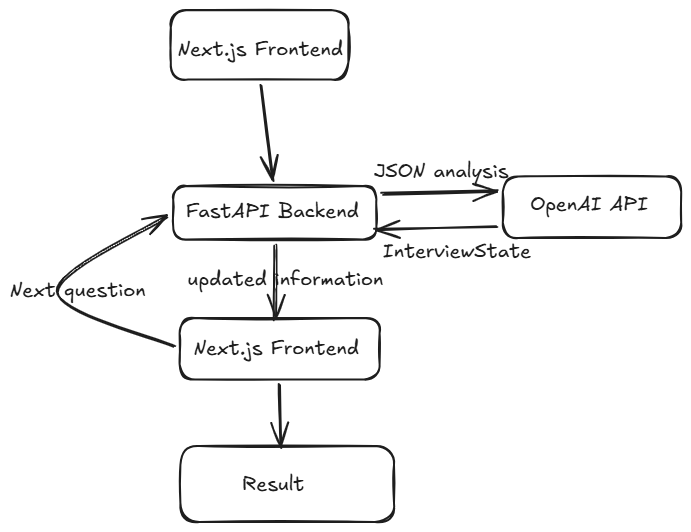

# AI-Powered Skill Assessment & Personalised Learning Plan Agent 🤖

An intelligent technical auditor that moves beyond resume keyword matching. This agent conversationally validates real proficiency, detects hallucinations (Trust Risk), and builds custom learning roadmaps.

## 🌟 The Mission
Resumes tell you what someone *claims* to know. This agent finds out what they *actually* know by using dynamic, state-of-the-art technical auditing.

## 🛠️ Key Features
- **Dynamic Difficulty Scaling**: Questions adapt ($Easy \rightarrow Medium \rightarrow Hard$) based on the candidate's previous answers.
- **The Hallucination Trap**: Identifies factually incorrect claims or "fake" tool features to flag a **Trust Risk** (instant score drop to 0.5).
- **Weighted Evaluation**: Final scores are calculated using a weighted average based on skill importance defined in the Job Description.
- **Personalised Learning Roadmap**: Generates curated resources with time estimates scaled to the specific skill gaps identified.

## 📊 Logic & Scoring
- **Strong Answer**: +1.0
- **Moderate Answer**: +0.5 (Triggers a clarifying follow-up question)
- **Weak/IDK Answer**: -0.5
- **Hallucination**: Instant override to 0.5 (Trust Risk)
- **Formula**: `Total Score = Σ(Skill Score * Importance) / Σ(Importance)`

## 🏗️ Architecture

The system uses a **FastAPI** backend to manage state and scoring logic, with a **Next.js** frontend for the interactive audit. It utilizes **OpenAI GPT-4o-mini** for extraction, question generation, and evaluation.

## 🚀 Getting Started

### 1. Backend (FastAPI)
1. `cd backend`
2. `pip install -r requirements.txt`
3. Create a `.env` file and add: `OPENAI_API_KEY=your_key_here`
4. Run: `uvicorn main:app --reload`

### 2. Frontend (Next.js)
1. `cd frontend`
2. `npm install`
3. Run: `npm run dev`
4. Open [http://localhost:3000](http://localhost:3000)

